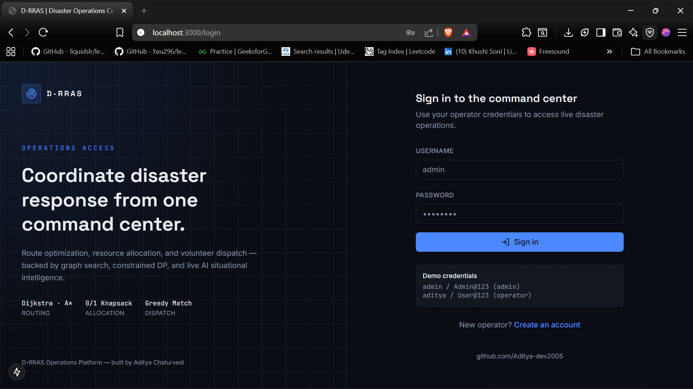
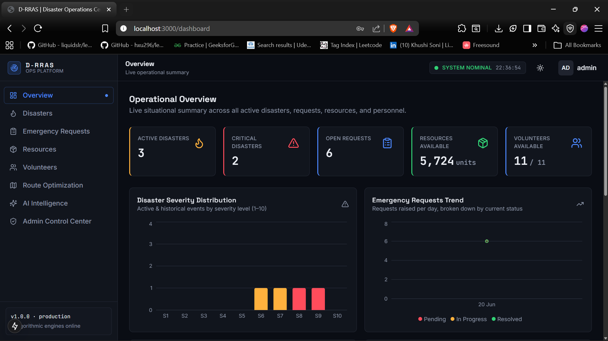
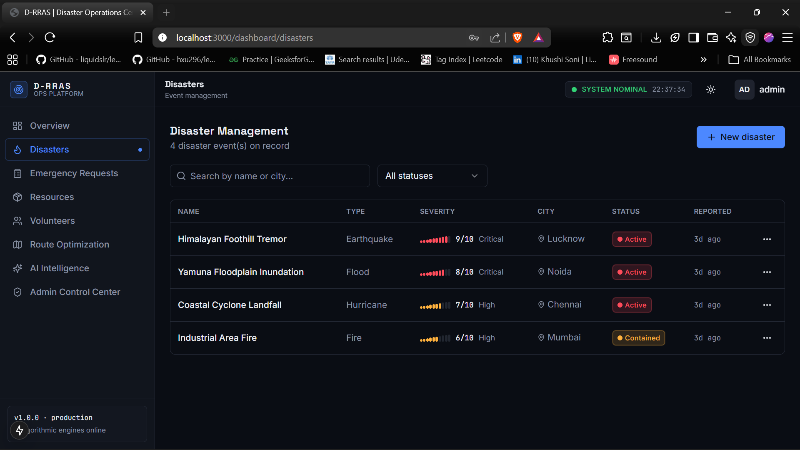
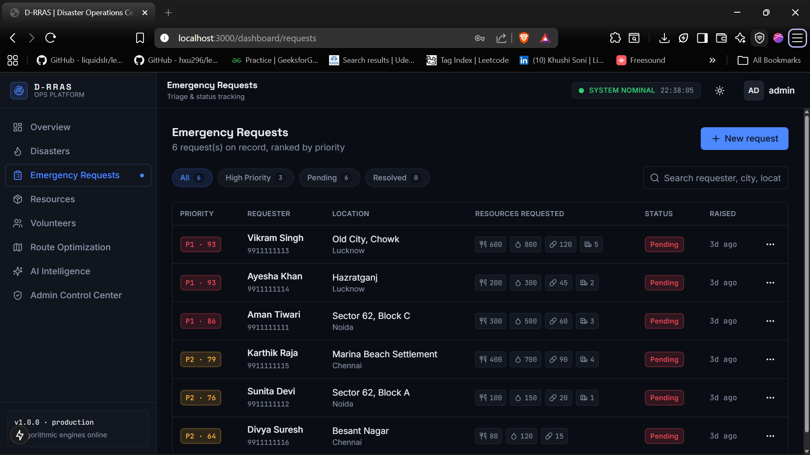
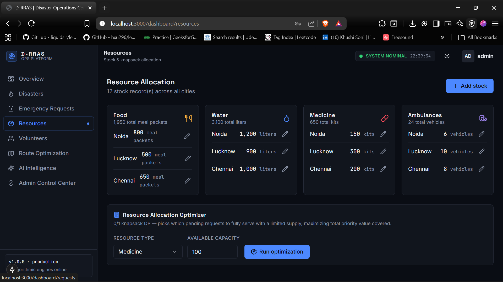
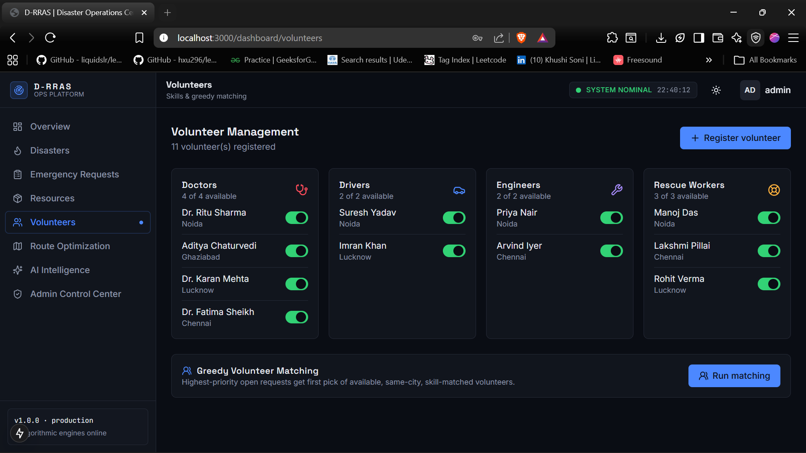
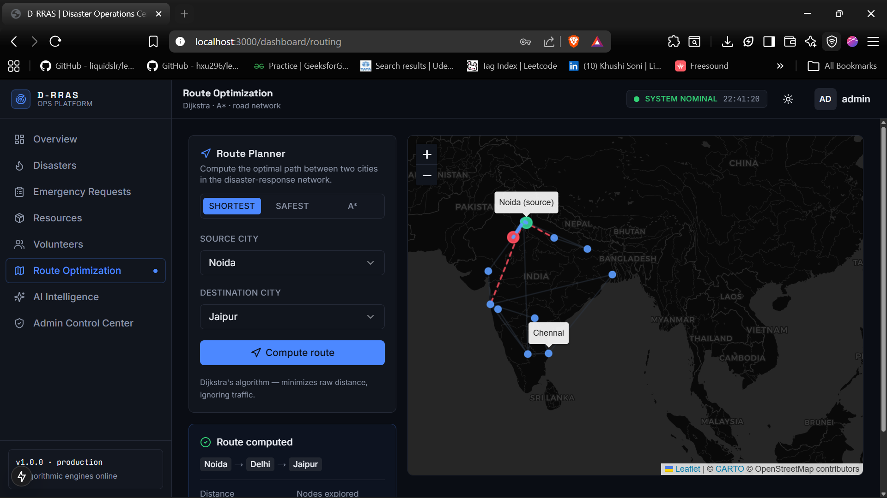
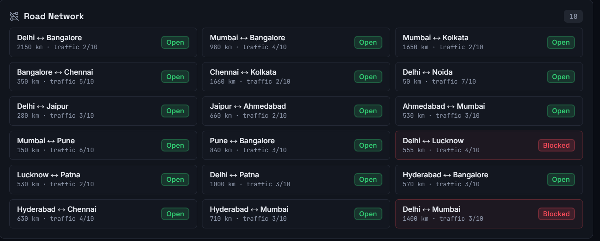
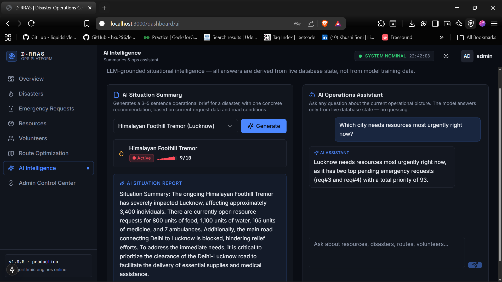
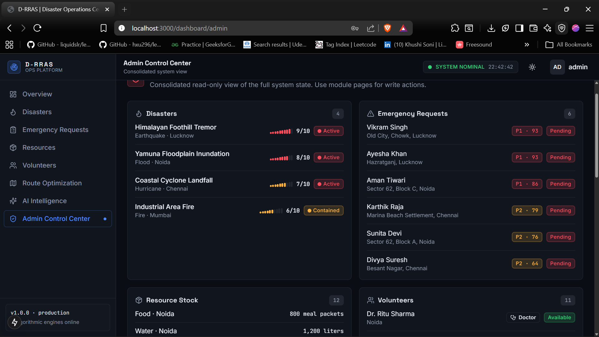

# D-RRAS — AI-Powered Disaster Response & Resource Allocation System


A production-grade full-stack disaster operations platform combining
**graph-based route optimization**, **constrained resource allocation via
0/1 Knapsack DP**, **greedy volunteer matching**, and **LLM-grounded
situational intelligence** — served through a REST API and a dark
ops-center dashboard.

> [](https://d-rras-ai-powered-disaster-response-resource-a-production.up.railway.app/login)

> **Backend API Docs:** [drras-production.up.railway.app](https://drras-production.up.railway.app/docs)

---

## The Problem

When a disaster strikes, emergency coordinators face four simultaneous
problems with no unified tool:

| Problem | Traditional Approach | D-RRAS Approach |
|---|---|---|
| Which route to the disaster zone? | Radio + local knowledge | Dijkstra + A* over live road graph |
| Who gets limited supplies? | First-come-first-served | 0/1 Knapsack DP maximizing priority coverage |
| Which volunteer goes where? | Manual phone calls | Greedy matching by skill + city + priority |
| What's happening right now? | Manual situation reports | LLM grounded in live database state |

---

## Architecture

```text
Browser (Next.js 15 Ops Dashboard)
   │  
   │  React Query (caching + mutations)
   │  Axios (JWT on every request)
   ▼
FastAPI (24 REST endpoints, JWT + RBAC)
   │
┌──┴───────────────────────────────────┐
│            Service Layer             │
│  Dijkstra │ A* │ Knapsack │ Greedy   │
│  AI Summary │ AI Assistant           │
└──┬───────────────────────────────────┘
   │  SQLAlchemy ORM
   ▼
PostgreSQL (6 tables, indexed)
   │
   ▼
OpenRouter (LLM completions)
```

**Design principles:** Stateless API (horizontal scaling behind any load
balancer), layered architecture (routers → services → models, one-direction
only), database-native graph (road_blocks table doubles as edge list + block
control), graceful AI degradation (503, not crash, on missing key).

---

## Algorithms

| Engine | Algorithm | Complexity | File |
|---|---|---|---|
| Shortest route | Dijkstra (binary heap) | O((V+E) log V) | `services/graph_service.py` |
| Safest route | Dijkstra + traffic weighting | O((V+E) log V) | `services/graph_service.py` |
| Optimal route | A* + haversine heuristic | O((V+E) log V), ~18% fewer nodes explored | `services/graph_service.py` |
| Resource allocation | 0/1 Knapsack DP | O(n × capacity) | `services/knapsack_service.py` |
| Volunteer dispatch | Greedy priority matching | O(n × m) | `services/matching_service.py` |

**A\* vs Dijkstra — measured:** On the `Noida → Chennai` route (9-node
subgraph), A* explored 9 nodes vs. Dijkstra's 11, returning the identical
optimal 2550km path. The haversine heuristic is admissible — it never
overestimates road distance — so A* guarantees optimality.

**Knapsack — why 0/1 specifically:** Emergency dispatch is binary — you
either send all 3 ambulances to a location or you don't. Partial
allocations create operational chaos. 0/1 knapsack mirrors real logistics
constraints.

---

## Tech Stack

| Layer | Technology | Why |
|---|---|---|
| API | FastAPI + Pydantic | Auto-validation, OpenAPI docs, Python typing |
| ORM | SQLAlchemy 2.0 | Parameterized queries (no injection), connection pooling |
| Auth | JWT (HS256) + bcrypt | Stateless, horizontally scalable, constant-time verify |
| AI | OpenRouter (OpenAI-compatible) | Model-agnostic, swap GPT/Claude/Llama via env var |
| Frontend | Next.js 15 + TypeScript | SSR, App Router, zero-error type safety |
| State | React Query + Zustand | Server state vs. UI state separation |
| Maps | Leaflet (react-leaflet) | Open source, SSR-safe with dynamic import |
| Charts | Recharts | Composable, Tailwind-compatible |
| Deployment | Docker Compose | One-command local + cloud reproducibility |

---

## Features

**Disaster Management** — Full CRUD with severity tracking (1-10),
multi-status lifecycle (active → contained → resolved), timeline view,
city search and status filtering.

**Emergency Requests** — Priority-ranked request table with computed
scores, inline status updates (admin), filter chips (high priority /
pending / resolved), resource needs breakdown per request.

**Route Optimization** — Interactive Leaflet map showing the city road
network, blocked roads highlighted, computed routes animated on the map.
Supports Dijkstra shortest, Dijkstra safest (traffic-penalized), and A*
with live switching. Toggle road blocks and watch the route recalculate.

**Resource Allocation** — Per-city stock grid with inline quantity editing
(admin). Knapsack optimizer panel: choose resource type and available
capacity, system returns the optimal subset of requests to serve and which
requests couldn't be covered.

**Volunteer Management** — Skill-grouped grid (doctors, drivers, engineers,
rescue workers), per-volunteer availability toggle, greedy matching panel
that assigns volunteers to open requests and shows unmatched requests.

**AI Intelligence Center** — Situation summary generator (structured DB
aggregation → LLM → operational brief), operations assistant chat (full
DB state as context → answers grounded in live data, not training data).

**Admin Control Center** — Consolidated read-only system view across all
6 tables on one page, admin-only route.

---

## Database Schema

```sql
users               -- identity + role (admin/user)
disasters           -- event: type, severity, city, status
emergency_requests  -- help request: resource needs, computed priority_score
resources           -- stock: food/water/medicine/ambulances per city
volunteers          -- people: skill_type, city, is_available
road_blocks         -- graph edges AND block control (city_from, city_to,
                    --   distance_km, traffic_level, is_blocked)
```

**Indexing strategy:** `priority_score DESC` (every request list read),
`status` (filter queries), `disaster_id` FK, `city` (matcher lookup),
`skill_type + is_available` (volunteer queries), `is_blocked` (graph
construction).

---

## API Overview
POST /auth/register      POST /auth/login       GET /auth/me
POST /disasters/         GET /disasters/         GET /disasters/{id}

PUT  /disasters/{id}     DELETE /disasters/{id}
POST /requests/          GET /requests/          GET /requests/{id}

PATCH /requests/{id}/status   DELETE /requests/{id}
POST /resources/         GET /resources/         PUT /resources/{id}

POST /volunteers/        GET /volunteers/         PATCH /volunteers/{id}/availability

POST /roadblocks/        GET /roadblocks/

PATCH /roadblocks/{id}/block   /unblock   /traffic
GET  /routing/shortest   GET /routing/safest     GET /routing/astar

POST /allocation/optimize

POST /matching/run
GET  /ai/summary/{disaster_id}

POST /ai/assistant
GET  /health

---

## Quick Start

```bash
# Backend (Docker)
cd drras-backend
cp .env.example .env
docker compose up --build
# → http://localhost:8000/docs  (login: admin / Admin@123)

# Frontend
cd drras-frontend
npm install && cp .env.local.example .env.local
npm run dev
# → http://localhost:3000
```

---

## Production Deployment

| Service | Platform | Cost |
|---|---|---|
| Database | Neon (serverless Postgres) | Free tier |
| Backend | Railway (Docker) | Free tier |
| Frontend | Vercel | Free tier |

```bash
# Generate production SECRET_KEY
python3 -c "import secrets; print(secrets.token_hex(32))"
```

See `drras-backend/README.md` for full step-by-step cloud deployment.

---

## System Design Highlights

- **Stateless API:** JWT-based auth — any number of instances behind a
  load balancer with no session store
- **Graph-as-table:** Road segments live in PostgreSQL, not memory — block
  a road via PATCH, next routing call reroutes automatically
- **Algorithm isolation:** All 4 engines are pure functions (data in,
  result out) — no HTTP knowledge, testable independently
- **AI grounding:** Context-stuffing pattern for AI responses — model
  instructed to answer ONLY from serialized DB state, preventing
  hallucinated resource numbers
- **Graceful degradation:** Remove `OPENROUTER_API_KEY` and the system
  continues working — AI endpoints return 503, nothing else breaks

---

## 📸 Screenshots

<table>
  <tr>
    <td align="center"><b>Login & Authentication</b></td>
    <td align="center"><b>Operations Overview Dashboard</b></td>
  </tr>
  <tr>
    <td></td>
    <td></td>
  </tr>
  <tr>
    <td align="center"><b>Disaster Management</b></td>
    <td align="center"><b>Emergency Request Management</b></td>
  </tr>
  <tr>
    <td></td>
    <td></td>
  </tr>
  <tr>
    <td align="center"><b>Resource Management</b></td>
    <td align="center"><b>Volunteer Management</b></td>
  </tr>
  <tr>
    <td></td>
    <td></td>
  </tr>
  <tr>
    <td align="center"><b>Route Optimization with Live Map</b></td>
    <td align="center"><b>Road Network & Block Control</b></td>
  </tr>
  <tr>
    <td></td>
    <td></td>
  </tr>
  <tr>
    <td align="center"><b>AI Intelligence Center</b></td>
    <td align="center"><b>Admin Control Center</b></td>
  </tr>
  <tr>
    <td></td>
    <td></td>
  </tr>
</table>

---

## Future Scope

- [ ] Alembic migrations for production schema evolution
- [ ] Redis caching for graph adjacency list (invalidated on road writes)
- [ ] WebSocket broadcast for real-time disaster alerts across all sessions
- [ ] Refresh token flow (short-lived access + long-lived refresh)
- [ ] Pytest test suite for all 4 algorithm services
- [ ] Structured logging with correlation IDs
- [ ] Rate limiting per user (slowapi + Redis counter)

---

## Author

**Aditya Chaturvedi** — B.Tech CSE, JIIT Noida (2027)
[GitHub](https://github.com/Aditya-dev2005) · [LinkedIn](https://linkedin.com/in/aditya-chaturvedi05)
